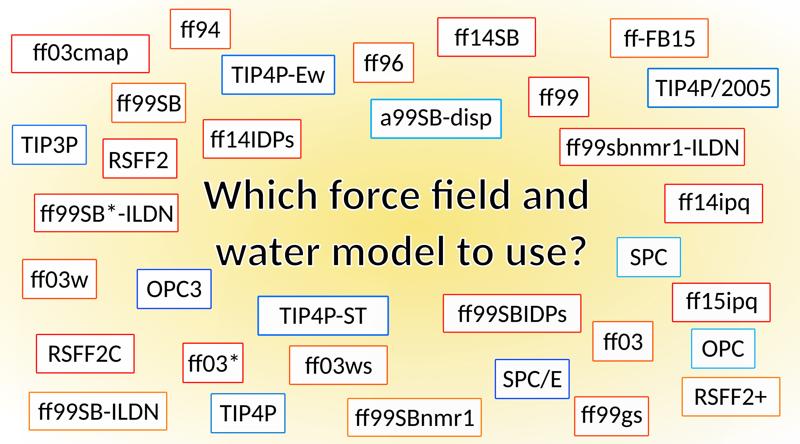

# Comparative Study of Folded/Unfolded Peptide Dynamics with Modern AMBER Force Fields and Water Models

 
  

 On this page we present the results of a comparative study in which 95 combinations of AMBER Force Fields and water models are used to simulate 4 different peptides performing Molecular Dynamics (MD) simulations.
 The four peptides have different secondary structures, and we verify which Force Field-Water Model combination better reproduces the experimental arrangment. Details about the studied systems and the performed analysis can be found in <a href="https://pubs.acs.org/doi/10.1021/bi000208x"> this paper </a>.   
The peptides studied have the following characteristics: 
<table style="margin: 0 auto;">
<thead>
<tr><th>Peptide</th><th>PDB Code</th><th>Sequence</th><th>Motif</th><th>Percentage of peptide adopting motif </th></tr>
</thead>
<tfoot>
<tr><td>B2</td><th><a href="https://www.science.org/doi/10.1126/science.1871600" target="_blank" rel="noopener noreferrer">2GB1(41-56)</a></th><th>GEWTYDDATKTFTVTE </th><th>ß-hairpin</th><th> <a href="https://www.nature.com/articles/nsb0994-584" target="_blank" rel="noopener noreferrer"> 50-60% </a> </th></tr>
</tfoot>
<tbody>
<tr><td> H1 </td><th><a href="https://pubs.acs.org/doi/10.1021/bi000208x" target="_blank" rel="noopener noreferrer"> 1DJF </a></th><th>QAPAYKKAAKKLAES </th><th> α-helix  </th><th> <a href="https://pubs.acs.org/doi/10.1021/bi000208x" target="_blank" rel="noopener noreferrer"> 0-10% </a>  </th></tr>
 <tr><td>H2</td><th><a href="https://www.nature.com/articles/nsb798" target="_blank" rel="noopener noreferrer">1L2Y</a></th><th>NLYIQWLKDGGPSSGRPPPS </th><th>α-helix</th><th><a href="https://www.nature.com/articles/nsb798" target="_blank" rel="noopener noreferrer"> 90-100% </a> </th></tr>
 <tr><td>B1</td><th><a href="https://www.science.org/doi/10.1126/science.1871600" target="_blank" rel="noopener noreferrer">2GB1(2-19)</a></th><th> TYKLILNGKTLKGETTTE</th><th>ß-hairpin</th><th> 
<a href="https://pubs.acs.org/doi/abs/10.1021/bi00185a041" target="_blank" rel="noopener noreferrer"> 0-10% </a>  </th></tr>
</tbody>
</table>
The five Force Fields tested are:
<ul>
 <li><a href="https://onlinelibrary.wiley.com/doi/10.1002/prot.22711" target="_blank" rel="noopener noreferrer" > ff99SB-ILDN </a> , <a href="https://pubs.acs.org/doi/10.1021/acs.jctc.5b00255" target="_blank" rel="noopener noreferrer" > ff14SB </a> , <a href="https://pubs.acs.org/doi/10.1021/acs.jctc.9b00591" target="_blank" rel="noopener noreferrer" >  ff19SB </a>, <a href="https://pubs.acs.org/doi/10.1021/acs.jpcb.7b02320" target="_blank" rel="noopener noreferrer" > ff-FB15 </a>, and <a href="https://pubs.acs.org/doi/10.1021/acs.jctc.6b00567" target="_blank" rel="noopener noreferrer" > ff15ipq </a>  with the nineteen Water Models: </li>
     <ul>
        <li><a href="https://link.springer.com/chapter/10.1007/978-94-015-7658-1_21" target="_blank" rel="noopener noreferrer" > SPC </a>, <a href="https://pubs.aip.org/aip/jcp/article- abstract/79/2/926/776316/Comparison-of-simple-potential-functions-for?redirectedFrom=fulltext" target="_blank" rel="noopener noreferrer" > TIP3P </a>, <a href="https://pubs.acs.org/doi/10.1021/j100308a038" target="_blank" rel="noopener noreferrer" > SPC/E </a>, <a href="https://pubs.aip.org/aip/jcp/article/121/20/10096/532393/A-modified-TIP3P-water-potential-for-simulation" target="_blank" rel="noopener noreferrer" >TIP3P-Ew</a>, <a href="https://pubs.acs.org/doi/10.1021/jp301100g" target="_blank" rel="noopener noreferrer" >SPC/Eb</a>, <a href="https://pubs.acs.org/doi/10.1021/jz500737m" target="_blank" rel="noopener noreferrer" >TIP3P-FB</a>, <a href="https://www.sciencedirect.com/science/article/pii/S0378437114009108" target="_blank" rel="noopener noreferrer" >SPC/ϵ</a>, <a href="https://pubs.aip.org/aip/jcp/article-abstract/145/7/074501/810108/Accuracy-limit-of-rigid-3-point-water-models?redirectedFrom=fulltext" target="_blank" rel="noopener noreferrer" >OPC3</a>, <a href="https://pubs.acs.org/doi/10.1021/acs.jpcb.9b05455" target="_blank" rel="noopener noreferrer" >TIP3P-ST;</a></li>
        <li><a href="https://pubs.aip.org/aip/jcp/article-abstract/79/2/926/776316/Comparison-of-simple-potential-functions-for?redirectedFrom=fulltext" target="_blank" rel="noopener noreferrer" >TIP4P</a>, <a href="https://pubs.aip.org/aip/jcp/article-abstract/125/3/034503/564425/Vapor-liquid-equilibria-from-the-triple-point-up?redirectedFrom=fulltext" target="_blank" rel="noopener noreferrer" >TIP4P-Ew</a>, <a href="https://pubs.aip.org/aip/jcp/article-abstract/125/3/034503/564425/Vapor-liquid-equilibria-from-the-triple-point-up?redirectedFrom=fulltext" target="_blank" rel="noopener noreferrer" >TIP4P/2005</a>,
<a href="https://pubs.acs.org/doi/10.1021/jz500737m" target="_blank" rel="noopener noreferrer" >TIP4P-FB </a>, <a href="https://pubs.acs.org/doi/10.1021/jz501780a" target="_blank" rel="noopener noreferrer" >OPC</a>, <a href="https://pubs.acs.org/doi/10.1021/jp410865y" target="_blank" rel="noopener noreferrer" >TIP4P/ϵ</a>, <a href="https://pubs.acs.org/doi/10.1021/jp508971m" target="_blank" rel="noopener noreferrer" >TIP4P-D</a>, <a href="https://www.pnas.org/doi/full/10.1073/pnas.1800690115" target="_blank" rel="noopener noreferrer" >a99SB-disp</a>, <a href="https://pubs.acs.org/doi/10.1021/acs.jpcb.9b05455" target="_blank" rel="noopener noreferrer" >TIP4P-ST</a>, and <a href="https://pubs.rsc.org/en/content/articlelanding/2021/cp/d0cp05831a" target="_blank" rel="noopener noreferrer" >TIP4P-BG.</a></li>
     </ul>
</ul>

 
To visualize the results, it is necessary to select a <b>Peptide</b>, a <b>Force Field</b> and a <b>Water Model</b> <a href="selezione.html"> <b>here</b>  </a>.

 Michele Casoria, Marina Macchiagodena, Anna Maria Papini, Claudia Andreini, Marco Pagliai,Piero Procacci  
 Dipartimento di Chimica "Ugo Schiff", Università degli Studi di Firenze, Via della Lastruccia 3, 50019 Sesto Fiorentino, Italy  
 If you have any questions, please feel free to contact the <a href="mailto:marina.macchiagodena@unifi.it,michele.casoria@unifi.it">authors</a>.
  
